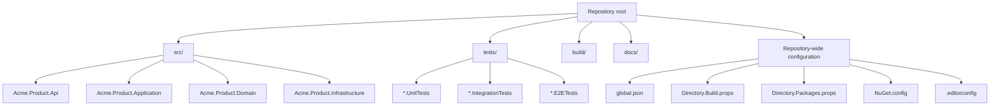

# Cross-Platform C#/.NET Engineering Standard

## Executive Summary

> **Portable by design, reproducible by default, and platform-specific only by deliberate exception.**

| Document attribute | Value |
|---|---|
| Document ID | `ENG-STD-DOTNET-XPLAT` |
| Title | Cross-Platform C#/.NET Engineering Standard |
| Status | Proposed corporate standard — Oracle-feedback revision; pending owner approval |
| Standard version | `1.1.0-draft.1` |
| Baseline date | October 2, 2026 |
| Primary production baseline | .NET 10 LTS / `net10.0` |
| Stable C# baseline | C# 14 |
| Required OS families | Windows, Linux, macOS |
| Standards owner | Engineering Standards / Platform Engineering |
| Review cadence | Quarterly and on every .NET major release |
| Normative vocabulary | **MUST / MUST NOT**, **SHOULD / SHOULD NOT**, **MAY**, **AVOID** |
| Effective date | Not yet effective; set by the approving RFC |
| Revision scope | Oracle feedback, directly affected examples, and enforcement traceability |

> **Editorial provenance.** This working revision derives from the supplied `1.0.0` standard and Oracle feedback. Its original organization and unaffected requirements are retained. Sources identified as `[Rxx]` support the technical changes checked for this revision; inherited narrative outside that scope has not received a complete independent source audit. Original chat-local citation handles were removed because their underlying URLs were not supplied. The corporate writing guide mentioned in the original was not independently available. No .NET builds, Docker builds, or native-platform tests were executed for this document.

This standard defines how cross-platform C#/.NET software is designed, structured, built, tested, packaged, secured, operated, and governed when the same codebase is expected to run on Windows, Linux, and macOS.

As of **October 2, 2026, .NET 10 is the current generally available LTS release**. Microsoft lists .NET 10 as active LTS, with the current servicing release at **10.0.12**, released September 8, 2026, and support through November 14, 2028. The corresponding current SDK servicing line includes **10.0.401**. .NET 9 and .NET 8 remain supported only until November 10, 2026, making them inappropriate baselines for new corporate projects at this point in their lifecycle. The .NET 10 runtime/SDK values and support end date above were checked against Microsoft’s release metadata. [R01]

.NET 11 has reached **RC1**, version `11.0.0-rc.1`, released September 8, 2026. Microsoft designates this release "Go Live", meaning it is supported for production use, and provides Windows, Linux, and macOS builds. It remains a prerelease, however. Therefore, this standard treats .NET 11 RC1 as an **opt-in forward-validation target**, not the default corporate production baseline.

The document preserves the source standard’s standards-writing approach: mechanical rules belong in automation rather than duplicated prose; human-judgment rules use **MUST / SHOULD / AVOID**; complex subjects state rationale before directives; deliberate violations require searchable overrides; legacy code is modernized within the change's blast radius; and standards evolve through a reviewed RFC and sunset process.

**Executive requirements.** New production projects **MUST** target `net10.0`, use an approved .NET 10 SDK pinned through `global.json`, build successfully through the `dotnet` CLI, and remain source-portable across Windows, Linux, and macOS unless their declared product scope explicitly excludes a platform. The CI pipeline **MUST** exercise all claimed platform families rather than relying on compilation alone.

The source repository **MUST** be the source of truth for formatting, analyzers, dependency versions, SDK selection, build commands, and tests. Developer IDE settings are convenience settings only.

Third-party dependencies **MUST** be centrally versioned where practical, restored deterministically, vulnerability-audited, and sourced from explicitly approved NuGet feeds. Public packages **MUST** use SemVer and automated API-compatibility validation.

Cross-platform code **MUST NOT** assume Windows path separators, case-insensitive names, Windows native libraries, a particular newline, local machine culture, or x64. Platform-specific behavior **MUST** be isolated behind explicit platform boundaries and checked with .NET's platform compatibility analyzer.

Deployments **MUST** be produced from immutable CI artifacts. Containers are the default recommendation for network services; framework-dependent, self-contained, single-file, and Native AOT deployments remain valid where their operational tradeoffs fit the product.

Production code **MUST** use structured logging, externalized configuration, external secret storage, dependency/security scanning, supported runtimes, and sufficient logs, metrics, and traces to diagnose failures without rebuilding the application.

The quick-reference interpretation is:

| Topic | Prefer | Avoid |
|---|---|---|
| Runtime | .NET 10 LTS, latest servicing patch | EOL or nearly-EOL runtime |
| TFM | `net10.0` | Old TFMs without compatibility need |
| SDK | Repository `global.json` | Whatever SDK happens to be installed |
| Solution | `.slnx` | Tool-specific project collections |
| Layout | `src/`, `tests/`, `docs/`, `build/` | Mixed production/test projects |
| Namespaces | Product-oriented, stable namespaces | Namespace mirroring accidental folder depth |
| Style | `.editorconfig` + Roslyn + CI | Reviewer-enforced whitespace rules |
| Dependencies | Central Package Management + lock files | Floating versions |
| Feeds | Explicit source mapping | Ambiguous public/private feed resolution |
| CI | `dotnet` CLI behind thin provider wrapper | Provider-specific build semantics |
| Testing | Unit → integration → E2E pyramid | E2E-only confidence |
| File paths | `System.IO.Path` APIs | Embedded `\` or `/` assumptions |
| Platform code | Analyzer + guards + adapters | Scattered `#if` blocks |
| Packaging | Explicit deployment mode | Accidental SDK defaults |
| Services | Multi-stage, non-root containers | SDK image in production |
| Configuration | `IConfiguration` + typed options | Static global configuration access |
| Secrets | External secret store | Source control or `appsettings*.json` |
| Logging | Structured `ILogger` | Interpolated opaque strings |
| Telemetry | OpenTelemetry-compatible instrumentation | Vendor-specific application APIs |
| Compatibility | SemVer + package validation | Undocumented breaking changes |
| Performance | Measure, trace, then optimize | Speculative micro-optimization |
| Exceptions | Time-bounded documented override | Silent analyzer suppression |

## Normative Foundation and Platform Baseline

**Rule group `DOTNET-BASE-004` — Scope, vocabulary, and servicing policy.**

**Purpose and scope.** This standard applies to SDK-style C# projects and libraries intended to execute on modern .NET across Windows, Linux, and macOS. It applies to console applications, workers, web/API services, reusable class libraries, command-line tools, test projects, NuGet packages, and containerized applications. UI stacks or workloads whose frameworks are inherently platform-specific may adopt this standard for their portable layers while documenting narrower runtime support.

The standard does not require every product to ship on every OS. It does require a project claiming to be "cross-platform" to state its supported OS/architecture matrix and to test every claimed platform family. A project that only tests Windows is not considered cross-platform under this standard.

**Normative terminology.**

| Keyword | Meaning |
|---|---|
| **MUST** | Mandatory. A violation blocks approval unless a formal exception is recorded. |
| **SHOULD** | Expected default. A deviation requires an explicit technical reason. |
| **MUST NOT** | Prohibited unless the applicable exception protocol permits and approves a narrow deviation. |
| **SHOULD NOT** | Discouraged default; departure requires an explicit technical reason. |
| **MAY** | Optional, subject to applicable MUST requirements. |
| **AVOID** | Permitted only where an identified tradeoff makes the discouraged approach appropriate. |

**Runtime and SDK baseline.** Microsoft uses an annual .NET release model; LTS releases receive three years of support and STS releases two years. Microsoft also requires supported systems to stay current on servicing updates rather than merely remaining on the original major release.

| Runtime / SDK line | Status on Oct. 2, 2026 | Corporate disposition |
|---|---|---|
| .NET 10 / SDK 10.0.401 servicing line | GA, LTS, active; runtime 10.0.12; support through Nov. 14, 2028 | **MUST** be default for new production work |
| .NET 11 RC1 / SDK 11.0.100-rc.1 | Prerelease, Microsoft Go-Live supported | **MAY** be used for forward validation or by approved exception |
| .NET 9 | Supported until Nov. 10, 2026; maintenance stage | **MUST NOT** be selected for new projects; migrate |
| .NET 8 LTS | Supported until Nov. 10, 2026 | **MUST NOT** be selected for new projects; migrate |
| Earlier .NET | Out of support | **MUST NOT** be deployed without a security-approved exception |

The exact currently supported servicing versions change monthly. **Production environments MUST consume the latest approved servicing patch within the organization's patch SLA.** Microsoft's .NET release/security guidance explicitly notes that old patch levels can contain known vulnerabilities, even when the major release itself remains supported.

For a stable project:

```json
{
  "sdk": {
    "version": "10.0.401",
    "rollForward": "latestPatch",
    "allowPrerelease": false
  },
  "test": {
    "runner": "Microsoft.Testing.Platform"
  }
}
```

The `test` entry selects the preferred .NET 10 Microsoft.Testing.Platform (MTP) command profile; all included test projects must support MTP 1.7 or later. An approved VSTest repository uses its corresponding command profile consistently instead. [R21]

`global.json` controls SDK selection independently of the runtime TFM. Microsoft specifically identifies CI as a scenario where an acceptable SDK version range should be declared rather than accepting whichever SDK is installed on the machine.

**Standard `DOTNET-BASE-001`:** repositories **MUST** contain a root `global.json`. Its version **MUST** be advanced as part of routine dependency/platform maintenance.

**Standard `DOTNET-BASE-002`:** stable branches **MUST NOT** use `allowPrerelease: true`, `rollForward: latestMajor`, or an equivalent mechanism that can silently advance the compiler/runtime generation.

**Standard `DOTNET-BASE-003`:** the SDK version is a build-tool decision; the TFM is a runtime/API-contract decision. They **MUST NOT** be treated as interchangeable.

**Rule group `DOTNET-BASE-005` — Target frameworks and language baseline.**

**Target frameworks.** Modern applications and libraries that only serve modern .NET **MUST** use `net10.0`. Microsoft's current TFM catalog includes `net10.0`, while .NET Standard remains relevant for libraries that genuinely need compatibility with different .NET implementations. Microsoft specifically recommends `netstandard2.0` when code must be shared between modern .NET and .NET Framework.

| Scenario | Required/default TFM |
|---|---|
| New executable/service/tool | `net10.0` |
| Internal library consumed only by modern corporate applications | `net10.0` |
| NuGet library needing both modern .NET and .NET Framework consumers | `netstandard2.0`, normally together with a modern target where beneficial |
| Platform-specific Windows component | `net10.0-windows` only in platform-specific project |
| Forward-validation branch | `net11.0` only when approved for .NET 11 validation |
| Existing library with legitimate multi-target requirement | Smallest justified `TargetFrameworks` set |

**AVOID** multi-targeting merely because additional targets are technically possible. Every TFM multiplies compilation, test, packaging, analyzer, dependency-resolution, and compatibility surface area.

A broadly reusable package might deliberately use:

```xml
<TargetFrameworks>netstandard2.0;net10.0</TargetFrameworks>
```

A new service should simply use:

```xml
<TargetFramework>net10.0</TargetFramework>
```

**C# language baseline.** .NET 10 ships with C# 14 tooling. New stable projects **SHOULD** use the default stable language version selected by the approved .NET 10 SDK rather than `LangVersion=preview`.

**Rule group `DOTNET-BASE-006` — Supported platforms and forward validation.**

**Operating-system support.** Microsoft's .NET 10 support matrix currently covers actively supported Windows generations, multiple Linux distributions and architectures, and macOS 15, 26, and 27. The Linux list includes distributions such as Ubuntu, RHEL, Debian, Alpine, Fedora, SLES, openSUSE, Azure Linux, and CentOS Stream.

The corporate standard separates **upstream support** from **product certification**. A platform being supported by Microsoft does not imply that an individual product has tested and promised support for it.

| OS family | Recommended corporate certification set | Typical portable RID | Required validation |
|---|---|---|---|
| Windows client | Windows 11 24H2 or newer; x64, Arm64 where claimed | `win-x64`, `win-arm64` | Build + automated tests |
| Windows Server | Server 2022 / 2025 x64 where server deployment is supported | `win-x64` | Deployment/integration tests |
| Linux glibc baseline | Ubuntu 24.04 LTS x64; Arm64 if claimed | `linux-x64`, `linux-arm64` | Build + automated tests |
| Enterprise Linux | RHEL 9/10 or explicitly selected equivalent | `linux-x64`, `linux-arm64` | Qualification if customer-supported |
| Debian | Debian 13 if customer-supported | `linux-x64`, `linux-arm64` | Qualification if customer-supported |
| Alpine / musl | Alpine 3.21+ where selected | `linux-musl-x64`, `linux-musl-arm64` | Dedicated native/dependency tests |
| macOS | macOS 15 or newer supported by .NET 10; x64/Arm64 according to product scope | `osx-x64`, `osx-arm64` | Build + automated tests |

Portable, non-version-specific RIDs such as `win-x64`, `linux-x64`, `linux-arm64`, `linux-musl-x64`, `osx-x64`, and `osx-arm64` are Microsoft's recommended model; since .NET 8 the SDK relies on the smaller portable RID graph rather than encouraging distro/version-specific RIDs.

**MUST:** each product publishes its exact supported OS/architecture matrix.

**MUST:** the release pipeline validates all Tier-1 product platforms.

**AVOID:** treating emulation as release qualification for an architecture. Microsoft's .NET 10 support matrix specifically does not regard QEMU as a supported substitute for running .NET applications on the native target.

**Forward version policy.** When .NET 11 reaches GA, Platform Engineering **MUST** open a standards RFC to determine whether it becomes the allowed "current" target while .NET 10 remains the LTS production default. The update is not automatic: framework upgrades can change analyzers, SDK behavior, container bases, compiler behavior, and runtime compatibility.

## Repository Architecture and Code Quality

**Repository model.** .NET 10 changed `dotnet new sln` to create the newer `.slnx` solution format by default. Microsoft describes SLNX as stable, supported by major .NET tooling, and easier to maintain than the legacy solution format.

Therefore:

**`DOTNET-REPO-001`: new repositories MUST use `.slnx` unless required tooling cannot consume it.**

**`DOTNET-REPO-002`: source, tests, build automation, documentation, package configuration, and standards configuration MUST be clearly separated.**

Recommended repository:

```text
repo/
├── Acme.Product.slnx
├── global.json
├── Directory.Build.props
├── Directory.Build.targets
├── Directory.Packages.props
├── NuGet.config
├── .editorconfig
├── .gitattributes
├── .dockerignore
├── README.md
├── CONTRIBUTING.md
├── src/
│   ├── Acme.Product.Api/
│   │   ├── Acme.Product.Api.csproj
│   │   └── ...
│   ├── Acme.Product.Application/
│   │   ├── Acme.Product.Application.csproj
│   │   └── ...
│   ├── Acme.Product.Domain/
│   │   ├── Acme.Product.Domain.csproj
│   │   └── ...
│   └── Acme.Product.Infrastructure/
│       ├── Acme.Product.Infrastructure.csproj
│       └── ...
├── tests/
│   ├── Acme.Product.Domain.UnitTests/
│   ├── Acme.Product.IntegrationTests/
│   └── Acme.Product.E2ETests/
├── build/
│   └── ...
└── docs/
    ├── architecture/
    └── standards/
        ├── overrides.yaml
        └── rule-catalog.json
```



The diagram is an organizational convention, not an instruction to create artificial architectural layers. A small CLI may need one source project and one test project. **SHOULD:** use the smallest project graph that produces meaningful dependency boundaries.

**Rule group `DOTNET-REPO-003` — Project identity and dependency boundaries.**

**Project naming.** Production project names **MUST** use stable PascalCase identifiers such as `Company.Product.Component`. Test projects **MUST** identify their purpose, for example `Company.Product.Component.UnitTests`.

**Namespaces.** The root namespace **MUST** normally follow the assembly's stable logical identity:

```csharp
namespace Acme.Payments.Settlement;
```

Folders **SHOULD** correspond to namespace segments where those folders represent real domain or architectural concepts. Namespaces **MUST NOT** mechanically mirror incidental folders such as `src`, `Implementation`, `Helpers`, `Common`, or arbitrary refactoring groupings.

**Prefer:** domain-oriented names such as:

```text
Acme.Payments
Acme.Payments.Settlement
Acme.Payments.Risk
```

**Avoid:**

```text
Acme.Payments.Src.Common.Helpers.Implementation
```

**Dependencies between projects.** The project graph **MUST** remain acyclic. Domain/core packages **SHOULD NOT** depend on deployment, database, web-host, or platform-specific projects. Platform-specific implementations **SHOULD** depend inward on portable abstractions.

**Rule group `DOTNET-REPO-004` — Analyzers, warnings, symbols, and source style.**

**Coding style and analyzers.** Modern .NET SDKs include Roslyn code-quality analyzers; for .NET 5+ projects the built-in quality analysis infrastructure is enabled by default, while code-style enforcement during builds requires explicit configuration such as `EnforceCodeStyleInBuild`. .NET 10 enables CA1416 platform compatibility analysis as a warning by default.

This standard’s automation-first principle is especially important here: indentation, using-directive ordering, formatting, naming diagnostics, unused code, and mechanically detectable portability violations **MUST** be expressed in `.editorconfig`, MSBuild configuration, analyzers, or CI rather than prose-only review rules.

A deployable console application's project file can remain small when the shared configuration below is present. Web services use `Microsoft.NET.Sdk.Web` instead of the console SDK/output-type combination.

```xml
<Project Sdk="Microsoft.NET.Sdk">
  <PropertyGroup>
    <OutputType>Exe</OutputType>
    <TargetFramework>net10.0</TargetFramework>
    <RestorePackagesWithLockFile>true</RestorePackagesWithLockFile>
  </PropertyGroup>
</Project>
```

Repository-wide `Directory.Build.props`:

```xml
<Project>
  <PropertyGroup>
    <Nullable>enable</Nullable>
    <ImplicitUsings>enable</ImplicitUsings>
    <EnforceCodeStyleInBuild>true</EnforceCodeStyleInBuild>
    <AnalysisLevel>10-recommended</AnalysisLevel>

    <TreatWarningsAsErrors>true</TreatWarningsAsErrors>
    <TreatWarningsAsErrors
      Condition="'$(LocalWarningRelaxation)' == 'true' and '$(ContinuousIntegrationBuild)' != 'true'">false</TreatWarningsAsErrors>
    <WarningsAsErrors>$(WarningsAsErrors);CA1416;nullable</WarningsAsErrors>

    <Deterministic>true</Deterministic>
    <DebugType>portable</DebugType>
    <EmbedUntrackedSources>true</EmbedUntrackedSources>
  </PropertyGroup>
</Project>
```

**Warning policy.** CI and release publication **MUST** fail on the configured compiler/analyzer warnings. Strict local builds remain the default; a developer **MAY** temporarily use `-p:LocalWarningRelaxation=true` for a local iteration. That option **MUST NOT** disable analyzers, hide diagnostics, bypass CA1416/nullability errors, or be used to produce releasable artifacts. Committed suppressions still require the applicable exception process.

The CI entry point **MUST** pass `-p:ContinuousIntegrationBuild=true` explicitly and reject a requested local relaxation. `TreatWarningsAsErrors` is not a universal MSBuild-task warning switch; `-warnaserror` covers MSBuild task warnings as well. Restore/audit gates need their own approved severity policy. [R14]

Repository-wide `Directory.Build.targets` provides a configuration tripwire; protected CI remains the authority:

```xml
<Project>
  <Target Name="ValidateCorporateCiSettings"
          BeforeTargets="PrepareForBuild;Pack;Publish"
          Condition="'$(ContinuousIntegrationBuild)' == 'true'">
    <Error Condition="'$(LocalWarningRelaxation)' == 'true'"
           Text="LocalWarningRelaxation is not permitted in CI." />
    <Error Condition="'$(TreatWarningsAsErrors)' != 'true'"
           Text="CI requires TreatWarningsAsErrors=true." />
  </Target>
</Project>
```

This target does not authorize `NoWarn` or `WarningsNotAsErrors`; the standards gate **MUST** validate all diagnostic-suppression mechanisms against approved exceptions. A project cannot establish approval by editing its own gate or an `approved_by` field.

**Symbols and Source Link.** Source Link and untracked-source embedding are already enabled by default for supported providers in .NET SDK 8+. The explicit embedding setting above records policy rather than enabling a missing .NET 10 capability. For distributable NuGet packages, set `<PublishRepositoryUrl>true</PublishRepositoryUrl>` in the package project. That property publishes repository metadata; it does not make a build deterministic. [R15]

Official builds **MUST** retain matching portable PDBs and commit-specific source metadata, preserve Git metadata or provide equivalent validated source metadata, and verify source retrieval from a clean checkout at a different absolute path. `ContinuousIntegrationBuild` enables official-build behaviors such as path normalization; do not enable it globally for ordinary local debugging. [R16]

Embedded compiler-input source and repository metadata **MUST** be reviewed under the artifact-disclosure policy. Source embedding does not indiscriminately embed every file in the checkout, but generated/untracked source can still contain sensitive information. Deterministic compilation does not, by itself, establish byte-for-byte reproducibility of archives, signing, or container images.

A practical `.editorconfig` baseline is:

```ini
root = true

[*]
charset = utf-8
end_of_line = lf
insert_final_newline = true
trim_trailing_whitespace = true

[*.{cs,csx}]
indent_style = space
indent_size = 4

# Namespace style
csharp_style_namespace_declarations = file_scoped:warning

# Type inference: explicit when it communicates otherwise-hidden type,
# var when the type is obvious from the expression.
csharp_style_var_for_built_in_types = false:suggestion
csharp_style_var_when_type_is_apparent = true:suggestion
csharp_style_var_elsewhere = false:suggestion

# Accessibility and using directives
dotnet_style_require_accessibility_modifiers = for_non_interface_members:warning
dotnet_sort_system_directives_first = true
dotnet_separate_import_directive_groups = false

# Formatting and naming diagnostics
dotnet_diagnostic.IDE0055.severity = warning
dotnet_diagnostic.IDE1006.severity = warning

# Portability is a build concern, not an IDE suggestion.
dotnet_diagnostic.CA1416.severity = warning

# Security diagnostics must remain visible.
dotnet_analyzer_diagnostic.category-Security.severity = warning
```

Microsoft's default .NET naming conventions use PascalCase for classes, structures, enums, properties, methods, and events, and an `I` prefix for interfaces. IDE1006 provides naming-style diagnostics, while IDE0055 represents formatting violations.

**MUST:** CI executes formatting/analyzer verification.

**MUST:** warnings produced by corporate analyzer configuration are build failures in CI and release publication unless an approved exception applies. Local-only relaxation follows the warning policy above.

**AVOID:** blanket `NoWarn`, `#pragma warning disable`, or category-wide analyzer suppression.

**SHOULD:** suppress an analyzer at the narrowest legitimate scope and include a reason.

**Generated code.** Generated artifacts **MUST NOT** be manually edited. Analyzer and formatting exemptions for generated files **MUST** be configured centrally, not scattered through generated source.

**Line endings.** Source-controlled text **SHOULD** normalize to LF to eliminate operating-system-dependent diffs. Scripts that technically require CRLF may receive explicit `.gitattributes` exceptions. Runtime code **MUST NOT** infer protocol or file format line endings from the developer OS unless the format itself defines native line endings.

**Example platform-neutral C# style:**

```csharp
using System.Globalization;
using System.IO;

namespace Acme.Product.Storage;

public sealed class ReportStore
{
    public string GetReportPath(string root, DateOnly date)
    {
        ArgumentException.ThrowIfNullOrWhiteSpace(root);

        string fileName =
            string.Create(
                CultureInfo.InvariantCulture,
                $"report-{date:yyyy-MM-dd}.json");

        return Path.Combine(root, "reports", fileName);
    }
}
```

`System.IO.Path` intentionally abstracts platform path syntax; separator characters and some path behavior differ by platform. Microsoft demonstrates that hard-coded backslashes can produce different and malformed-looking combinations on Unix systems.

## Dependencies, Versioning, and API Compatibility

**Dependency ownership.** NuGet's Central Package Management supports repository-level `Directory.Packages.props`, with package versions declared centrally and project files referencing packages without repeating versions. Only the nearest applicable `Directory.Packages.props` is automatically used, so large nested repositories must deliberately manage inheritance.

**`DOTNET-DEP-001`: multi-project repositories MUST use Central Package Management unless a documented technical limitation prevents it.**

Example:

```xml
<Project>
  <PropertyGroup>
    <ManagePackageVersionsCentrally>true</ManagePackageVersionsCentrally>
  </PropertyGroup>

  <ItemGroup>
    <PackageVersion Include="Microsoft.Extensions.Hosting"
                    Version="10.0.0" />
    <PackageVersion Include="Microsoft.Extensions.Http"
                    Version="10.0.0" />
  </ItemGroup>
</Project>
```

Project:

```xml
<ItemGroup>
  <PackageReference Include="Microsoft.Extensions.Hosting" />
  <PackageReference Include="Microsoft.Extensions.Http" />
</ItemGroup>
```

The numbers above illustrate centralization rather than a recommendation to freeze those packages forever. Package servicing **MUST** be driven by an automated update process and ordinary code review.

**Rule group `DOTNET-DEP-002` — Locked dependency and restore profiles.**

**Locking.** NuGet lock files provide deterministic dependency resolution and `--locked-mode` detects dependency graph changes rather than silently rewriting them. Microsoft recommends checking lock files into source control for applications; shared libraries have different considerations because their consumers independently resolve dependencies.

Accordingly:

| Artifact | Lock-file standard |
|---|---|
| Deployable app/service/tool | `packages.lock.json` **MUST** be committed |
| Integration/E2E test application | **SHOULD** be committed |
| General-purpose NuGet library | **MAY** omit lock file when consumer resolution is intentional |
| CI restore for locked project | **MUST** use `--locked-mode` |

```bash
dotnet restore --locked-mode
```

Floating dependency ranges such as `1.*`, `*`, or equivalent unbounded version expressions are **AVOID** because they make inputs mutable between builds.

**Multi-platform restore contract.** A lock file is not inherently Windows-only because it was generated on Windows. The relevant inputs are the evaluated dependency graph and restore profile. `RuntimeIdentifiers` requests RID assets during restore; it does not evaluate every host-OS-conditioned MSBuild branch or test those native assets. `NU1004` indicates an inconsistent locked graph and is not an OS-specific diagnosis. [R08][R09][R16]

Deployable projects **MUST** declare their supported restore/publish profiles. The recorded profile includes the SDK, TFM, requested RID(s), configuration, deployment mode, and any property/import that changes dependency selection (including AOT/trimming or package-pruning settings when applicable).

For one graph published to several platforms, configure only the RIDs actually shipped:

```xml
<PropertyGroup>
  <!-- Example product scope, not a mandatory organization-wide RID list. -->
  <RuntimeIdentifiers>win-x64;linux-x64;linux-arm64;osx-arm64</RuntimeIdentifiers>
  <RestorePackagesWithLockFile>true</RestorePackagesWithLockFile>
</PropertyGroup>
```

Portable IL-only libraries **MUST NOT** acquire an arbitrary RID matrix merely to satisfy this example. Alpine targets require their actual `linux-musl-*` profile, not a substituted `linux-*` profile.

Where host-conditioned references or genuinely different deployment profiles cannot share one lock graph, the repository **MUST** use named, allowlisted profiles with distinct committed lock paths (`NuGetLockFilePath`) or separate platform projects. A profile selector and its lock path **MUST** be the same for restore and the consuming build/test/publish operation. Do not overwrite one shared lock file independently in competing matrix jobs. [R08]

Dependency-update work **MUST** deliberately regenerate the affected profiles outside locked mode, review the resulting diff, and then validate locked restore across the complete supported matrix. CI **MUST NOT** recover from a locked-restore error by silently retrying unlocked or regenerating a lock file.

`--no-restore` **MUST** be used only with assets produced for the same relevant profile. For example, a framework-dependent Linux publication uses matching flags on both operations:

```bash
dotnet restore src/Acme.Product.Api/Acme.Product.Api.csproj \
  --locked-mode --runtime linux-x64 \
  -p:Configuration=Release -p:SelfContained=false -p:UseAppHost=false \
  -p:ContinuousIntegrationBuild=true

dotnet publish src/Acme.Product.Api/Acme.Product.Api.csproj \
  --configuration Release --runtime linux-x64 --self-contained false \
  --no-restore -p:UseAppHost=false -p:ContinuousIntegrationBuild=true \
  -warnaserror --output artifacts/publish/linux-x64
```

Matrix jobs **MUST** isolate `obj/`, `bin/`, and publish outputs. A package-download cache is not a reusable cross-platform `project.assets.json` or compilation cache. Template acceptance **MUST** cover a fresh locked restore and a no-restore publish for every supported profile, including a representative native dependency where the product uses one.


**Rule group `DOTNET-DEP-003` — Feed mapping and package-cache trust.**

**NuGet feeds and dependency confusion.** NuGet Package Source Mapping lets a repository state which package IDs may come from which source. Once source mapping is enabled, top-level and transitive packages must match a configured mapping; Microsoft recommends avoiding ambiguous mappings where the same package can resolve from multiple sources.

Example root `NuGet.config`:

```xml
<?xml version="1.0" encoding="utf-8"?>
<configuration>
  <packageSources>
    <clear />
    <add key="nuget.org"
         value="https://api.nuget.org/v3/index.json" />
    <add key="corporate"
         value="https://packages.example.invalid/v3/index.json" />
  </packageSources>

  <config>
    <add key="globalPackagesFolder" value=".nuget/packages" />
  </config>

  <packageSourceMapping>
    <packageSource key="corporate">
      <package pattern="Acme.*" />
    </packageSource>

    <packageSource key="nuget.org">
      <package pattern="Microsoft.*" />
      <package pattern="System.*" />
      <package pattern="*" />
    </packageSource>
  </packageSourceMapping>
</configuration>
```

The placeholder corporate feed address **MUST** be replaced by the organization's actual feed. Credentials **MUST NOT** appear in this file.

**MUST:** private feed credentials come from the CI provider's secret/authentication mechanism or workload identity.

**MUST:** repository configuration includes `<clear />` unless inheriting machine-wide feeds is an intentional and documented design.

**MUST:** internal namespace patterns are mapped only to trusted internal sources.

All newly created internal package IDs **MUST** use an organization-owned, reserved prefix such as `Acme.*`. A legacy internal ID outside that prefix **MUST** have an exact corporate-feed mapping before it is consumed. Publishing and dependency-update checks **MUST** enforce the prefix/explicit-ID policy; the naming convention is not sufficient as unwritten guidance.

The public `*` above is permitted only in this prefix-governed profile. NuGet chooses exact IDs before longest matching prefixes, and the generic `*` last. Thus `Acme.*` does not fall through to public `*`; an unmapped, non-prefixed private ID is the actual hazard. High-security repositories **MUST** use either a vetted single-source corporate mirror or reviewed explicit public package mappings with no public catch-all. Transitive packages need mappings too. [R10]

**Package-cache trust.** Packages already present in the global-packages folder can be used without a source lookup, so mapping alone does not verify an arbitrary pre-populated cache. Repositories **MUST** use a controlled package-cache location and trusted cache provenance. When mappings, trusted feeds, or a trust boundary change, perform a cold restore or invalidate the affected cache namespace. A lock-file content hash does not prove that initial package selection came from the intended publisher. [R10]

CI cache keys **MUST** include the lock inputs and source-policy configuration; include SDK/profile and other restore-affecting inputs. Untrusted jobs **MUST NOT** populate caches used as trusted release inputs. Dependency-caching controls **MUST NOT** skip current vulnerability evaluation. Sensitive feed credentials **MUST NOT** be included in shared cache contents.


**SHOULD:** every third-party dependency have an identifiable owner, license disposition, and upgrade path.

**Rule group `DOTNET-DEP-004` — Dependency vulnerability policy.**

**Security auditing.** Current NuGet/.NET tooling supports vulnerability auditing during restore and related vulnerable-package workflows. Dependency audit results **MUST** be evaluated in CI; high/critical vulnerabilities **MUST** block release unless Security grants an explicit time-bounded exception.

**Rule group `DOTNET-API-003` — Package versioning and compatibility contracts.**

**Package versioning.** NuGet supports Semantic Versioning. Under SemVer, major versions represent breaking changes, minor versions backward-compatible features, and patch versions backward-compatible fixes; prerelease identifiers represent non-stable versions.

Corporate packages **MUST** use the three-part form:

```text
MAJOR.MINOR.PATCH
```

Examples:

```text
3.4.2
4.0.0-rc.1
4.0.0
```

NuGet's broader parser accepts some version forms beyond strict SemVer; corporate packages **MUST NOT** exploit those extensions, such as a fourth numeric revision component, for new packages.

| Change | Package version effect |
|---|---|
| Backward-compatible defect fix | PATCH |
| New backward-compatible public API | MINOR |
| New optional capability | MINOR |
| Removal/rename of public member | MAJOR |
| Changed public parameter/return semantics that break consumers | MAJOR |
| Serialization or wire-contract incompatibility | MAJOR |
| Prerelease validation | `-alpha.N`, `-beta.N`, or `-rc.N` |

**MUST:** a package that has become a supported cross-team dependency should reach `1.0.0` rather than remaining indefinitely under ambiguous `0.x` compatibility semantics.

**MUST:** released package versions are immutable. Rebuilding different bits under an existing version is prohibited.

**MUST:** package source metadata identifies its source repository and commit where the build infrastructure supports it.

**API stability.** Microsoft's .NET package-validation tooling can detect breaking API differences against a baseline, inconsistencies between runtime-specific implementations, and holes among multi-targeted framework implementations. It can be enabled through `EnablePackageValidation`.

Reusable public package:

```xml
<Project Sdk="Microsoft.NET.Sdk">

  <PropertyGroup>
    <TargetFramework>net10.0</TargetFramework>
    <IsPackable>true</IsPackable>
    <EnablePackageValidation>true</EnablePackageValidation>
    <GenerateDocumentationFile>true</GenerateDocumentationFile>
    <PublishRepositoryUrl>true</PublishRepositoryUrl>
  </PropertyGroup>

</Project>
```

**`DOTNET-API-001`: externally or cross-team consumed libraries MUST run package/API compatibility validation in CI.**

**`DOTNET-API-002`: an API-compatibility suppression MUST identify the corresponding intentional SemVer-major change or approved compatibility exception.**

**Backward-compatibility policy.**

Stable public APIs **MUST** remain source and binary compatible throughout a major version wherever .NET's compatibility model permits it. A public API scheduled for removal **SHOULD** first be marked obsolete and documented with a replacement. Normal removal occurs only in the next major version.

Wire formats, persisted data formats, configuration keys, environment-variable names, command-line switches, event schemas, and externally consumed telemetry are also compatibility contracts. A method signature remaining unchanged does not make a release backward compatible if one of these contracts breaks.

A reasonable corporate minimum for a non-security removal is **one minor release and 90 days of deprecation**, whichever is longer. Security vulnerabilities, regulatory requirements, or actively harmful behavior may justify accelerated removal through the exception/governance process.

**Anti-pattern: accidental breaking change**

```csharp
// Version 2.3
public Task<Order> GetOrderAsync(
    string id,
    CancellationToken cancellationToken = default);

// "Small cleanup" in 2.4 — actually source/binary contract change.
public Task<Order> GetOrderAsync(
    OrderId id,
    CancellationToken cancellationToken = default);
```

**Prefer: additive evolution**

```csharp
public Task<Order> GetOrderAsync(
    string id,
    CancellationToken cancellationToken = default);

public Task<Order> GetOrderAsync(
    OrderId id,
    CancellationToken cancellationToken = default);
```

The old overload can then follow a documented deprecation lifecycle.

## Build, Test, Packaging, and Deployment

**Provider-independent pipeline model.** GitHub Actions, Azure Pipelines, and GitLab CI all support .NET builds. GitHub provides `setup-dotnet` and matrix workflows; Azure Pipelines provides `UseDotNet`/`.NET CLI` tasks and hosted/self-hosted agents; GitLab CI supports ordinary `dotnet` jobs, container execution, CI job tokens, and its package registry.

The standard deliberately does **not** prescribe one CI provider.

| Concern | GitHub Actions | Azure DevOps | GitLab CI |
|---|---|---|---|
| Native repository integration | Strong | Strong, especially Azure Repos | Strong |
| .NET SDK setup | `actions/setup-dotnet` | `UseDotNet@2` | SDK image/script |
| Cross-OS matrix | Native matrix strategy | Matrix/multi-job agents | Parallel/matrix jobs |
| Private packages | GitHub Packages/secrets/OIDC patterns | Azure Artifacts + `NuGetAuthenticate` | GitLab package registry + `CI_JOB_TOKEN` |
| Containerized jobs | Supported | Supported | Core workflow model |
| Provider-neutral `dotnet` CLI | Yes | Yes | Yes |
| Corporate standard status | Approved | Approved | Approved |

**`DOTNET-CI-001`: CI-provider YAML MUST remain a thin orchestration layer around repository-owned `dotnet` commands.**

In other words, this:

```bash
dotnet restore
dotnet build
dotnet test
dotnet pack
dotnet publish
```

is preferable to encoding unique build semantics that only one provider can reproduce.

**Rule group `DOTNET-CI-002` — Build and immutable artifact lifecycle.**

**Pipeline flow.**

```mermaid
flowchart LR
    A["Checkout immutable commit"] --> B["Select approved SDK"]
    B --> C["Restore locked dependencies"]
    C --> D["Dependency vulnerability audit"]
    D --> E["Format + Roslyn analyzers"]
    E --> F["Release build"]
    F --> G["Unit tests"]
    G --> H["Windows / Linux / macOS matrix"]
    H --> I["Integration tests"]
    I --> J["E2E / acceptance tests"]
    J --> K["Pack / publish once"]
    K --> L["SBOM, provenance, signing/scanning as applicable"]
    L --> M["Immutable artifact repository"]
    M --> N["Promote same artifact through environments"]
```



The pipeline **MUST** fail fast on deterministic failures such as restore, analyzer, compile, or unit-test errors. Expensive integration/E2E stages **MAY** run later.

**MUST:** production artifacts are created from a clean CI checkout.

**MUST:** Release configuration is compiled at least once before merge.

**MUST:** the same artifact that passed release acceptance is promoted to production; deployment **MUST NOT** rebuild source independently for each environment.

**MUST:** CI records source commit, SDK version, dependency resolution, artifact version, and test outcome.

**Rule group `DOTNET-CI-003` — Provider template and native architecture verification.**

**GitHub Actions example.** This is the .NET execution lane, not a complete release pipeline. Repositories also provide protected standards/override validation, feed authentication where required, vulnerability gates, and product-specific integration/artifact qualification. The action repositories document the version labels below; production workflows **MUST** resolve approved action versions to immutable commit SHAs and update them through review. [R18]

```yaml
name: ci

on:
  push:
    branches: [main]
  pull_request:

permissions:
  contents: read

env:
  NUGET_PACKAGES: ${{ github.workspace }}/.nuget/packages

jobs:
  build-and-test:
    strategy:
      fail-fast: false
      matrix:
        include:
          - os: ubuntu-24.04
            arch: x64
            rid: linux-x64
          - os: ubuntu-24.04-arm
            arch: arm64
            rid: linux-arm64
          - os: windows-2025
            arch: x64
            rid: win-x64
          - os: macos-15
            arch: arm64
            rid: osx-arm64

    runs-on: ${{ matrix.os }}
    env:
      EXPECTED_TEST_ARCH: ${{ matrix.arch }}

    steps:
      - name: Checkout
        uses: actions/checkout@v7 # Resolve to an approved immutable SHA.
        with:
          persist-credentials: false

      - name: Install approved .NET SDK
        uses: actions/setup-dotnet@v6 # Resolve to an approved immutable SHA.
        with:
          global-json-file: global.json
          architecture: ${{ matrix.arch }}
          cache: true
          cache-dependency-path: |
            **/packages*.lock.json
            **/*.csproj
            **/Directory.*.props
            **/Directory.*.targets
            NuGet.config
            global.json

      - name: Record runtime and SDK
        run: dotnet --info

      # Add the repository's authenticated feed setup before restore.
      # Add its protected standards and override gate before accepting this lane.
      - name: Restore
        run: >
          dotnet restore Acme.Product.slnx --locked-mode
          -p:Configuration=Release -p:ContinuousIntegrationBuild=true

      - name: Verify formatting
        run: >
          dotnet format Acme.Product.slnx
          --verify-no-changes --no-restore

      - name: Build
        run: >
          dotnet build Acme.Product.slnx
          --configuration Release --no-restore
          -p:ContinuousIntegrationBuild=true -warnaserror

      - name: Test
        run: >
          dotnet test --solution Acme.Product.slnx
          --configuration Release --no-build
          -p:ContinuousIntegrationBuild=true
```

**Architecture qualification.** Runner OS and CPU architecture **MUST** be explicit dimensions of the product matrix. The example includes native Linux Arm64, which an ordinary x64 Ubuntu lane does not validate. GitHub currently provides Linux Arm64 labels and both Intel and Arm64 macOS labels; neither “macOS” nor “Linux” implies one architecture. Runner entitlement and availability must be confirmed for the repository. [R17]

A platform test **MUST** compare `RuntimeInformation.ProcessArchitecture` with the lane's expected test architecture, and CI **MUST** record the observed OS/runtime. Installing an SDK or cross-publishing to a RID is not evidence that tests executed on that target. The `rid` matrix value above identifies the intended platform; it does not silently change restore/publish arguments. Products needing RID-specific test applications use the matching explicit restore/build/test profile.

Add Intel macOS, Windows Arm64, musl, or other lanes only when claimed by the product, and run the corresponding native/deployment tests. Multi-architecture container manifests **MUST** be exercised on each claimed native architecture. An x64 container runner, cross-compilation, or QEMU-only run does not establish native Linux Arm64 qualification.

Moving aliases such as `ubuntu-latest` **MAY** be used in additional drift-detection lanes. Formal release qualification **MUST** use the declared supported OS/architecture profiles. Explicit hosted labels still receive image updates: record the actual runner image version, or use controlled immutable runners where that identity is part of certification.

**Rule group `DOTNET-TEST-001` — Test runner, test levels, and coverage.**

**Testing architecture.** Microsoft's newer `Microsoft.Testing.Platform` is a lightweight test platform intended as an alternative to VSTest and can host MSTest, NUnit, xUnit.net, and other frameworks. MSTest has first-party Microsoft integration; xUnit.net v3 and NUnit also support modern .NET test workflows, including Microsoft.Testing.Platform integrations.

| Framework | Best fit | Standard position |
|---|---|---|
| MSTest + Microsoft.Testing.Platform | Microsoft-first enterprise baseline, direct platform alignment | **Preferred greenfield default** |
| xUnit.net v3 | Existing xUnit organizations, fixture/theory-centric testing, modern MTP integration | Approved |
| NUnit | Existing NUnit estates or teams relying on NUnit's assertion/fixture model | Approved |
| Multiple frameworks in same product without reason | Migration complexity and inconsistent conventions | **AVOID** |

Framework choice **MUST** be consistent at product/repository level unless a migration is underway.

**Test-runner contract.** Repository commands **MUST** agree with `global.json` and the selected test platform. The examples in this revision use native MTP mode: `dotnet test --solution Acme.Product.slnx` (or `--project` for one project). Approved VSTest repositories use the VSTest command form consistently; they must not blindly copy MTP-only options. All MTP projects require a compatible platform version (at least 1.7). [R21]

CI **MUST** fail on discovery failures and an unexpectedly empty test run. Test-result/coverage options **MUST** be verified with the installed runner and its extensions; a successful process exit alone does not prove that the intended suite ran.


Testing levels:

| Level | Purpose | External dependencies | CI expectation |
|---|---|---|---|
| Unit | Validate isolated behavior and edge cases | None or test doubles | Every PR, fast |
| Component | Validate a cohesive module | Minimal | Every PR when practical |
| Integration | Validate database/files/network/messaging/runtime boundaries | Real or realistic infrastructure | Every PR or gated branch |
| E2E | Validate deployed system from external boundary | Production-like stack | Release-critical flows |
| Compatibility | Validate prior clients/contracts/data | Prior artifact/contracts | Package/API products |
| Cross-platform | Detect OS/runtime assumptions | Native target OS | All claimed OS families |

**MUST:** unit tests remain deterministic and independent of execution order.

**MUST:** integration tests make their infrastructure dependency explicit.

**MUST:** an E2E suite cover critical product journeys, not reproduce every unit-level branch.

**MUST:** native interop is tested on every architecture/OS combination the product claims to support.

**SHOULD:** test data is generated or isolated per test so parallel execution cannot corrupt neighboring tests.

**Coverage.** Coverage is a diagnostic signal rather than a substitute for test design. A repository **MUST** establish a coverage baseline and **MUST NOT** silently reduce it. Teams **SHOULD** apply stronger branch/behavior requirements to security-critical and algorithmically complex code instead of pursuing a single organization-wide percentage.

Microsoft.Testing.Platform supports current code-coverage integrations, including Microsoft's coverage extension and Coverlet integration.

**Rule group `DOTNET-PKG-001` — Publication modes and runtime servicing.**

**Packaging modes.** .NET distinguishes framework-dependent and self-contained publication. Single-file publishing can apply to either model, and single-file outputs are OS/architecture-specific. Native AOT is a self-contained native compilation model with faster startup and lower memory potential but important reflection, dynamic-loading, trimming, and native-toolchain constraints.

| Mode | Runtime bundled? | Platform-specific? | Size | Runtime servicing owner | Preferred use |
|---|---:|---:|---|---|---|
| Framework-dependent | No | Usually no for portable IL | Smallest | Host/platform | Managed server fleets, developer tools |
| Self-contained | Yes | Yes | Larger | Application release | Appliances, isolated hosts, controlled desktop/CLI deployment |
| Single-file framework-dependent | No runtime | Yes | Moderate | Host/platform | Convenient CLI distribution where .NET exists |
| Single-file self-contained | Yes | Yes | Larger | Application release | Standalone CLI/application distribution |
| Native AOT | Yes, native | Yes | Workload-dependent | Application release | Startup/memory-sensitive services and tools after compatibility analysis |
| Container | Runtime in image layer | Image/arch-specific | Image-dependent | Image owner | Network services and immutable infrastructure |

A self-contained application captures a .NET runtime at publish time; therefore, the application owner is responsible for republishing it to consume runtime security updates. Framework-dependent apps can receive compatible runtime servicing from the host installation.

**Standard defaults.**

Network services **SHOULD** use Linux containers unless deployment constraints dictate otherwise.

Administrative/desktop/portable command-line tools **SHOULD** choose between framework-dependent and self-contained publishing based on whether deployment can guarantee an installed supported runtime.

Single-file deployment **SHOULD** be selected for operational convenience, not assumed to be inherently "more portable"; Microsoft notes it remains RID/OS-specific.

Native AOT **MUST** be treated as an explicit architectural decision because it restricts dynamic assembly loading, runtime code generation, C++/CLI, some COM behavior, and code that is incompatible with trimming.

**Rule group `DOTNET-CTR-001` — Container build inputs, cache, and runtime contract.**

**Container baseline.** Microsoft publishes separate SDK and runtime container images and regularly updates them with .NET and base-OS servicing. .NET container images have included a non-root `app` user since .NET 8; Microsoft's chiseled images further reduce installed components and default to non-root operation.

.NET 10's default container image tags switched from Debian to Ubuntu, so upgrades from older .NET generations should include container-base validation.

**Restore-layer input contract.** Container builds **MUST** separate restore inputs from frequently changing implementation source, while preserving project-relative directories. `COPY src/*/*.csproj ./src/` flattens the project files; it does not preserve their original project-reference layout. Explicit per-project copies or a tested restore-input manifest are acceptable. [R11][R12]

The restore layer **MUST** include every actual dependency input: `global.json`, applicable `.props`/`.targets`, central package files, source configuration, all referenced project files and required lock files, and any imported/generated restore input. Copy the solution and all its members if restoring the solution. Restoring just the deployment project's reference graph is usually preferable for an application image.

The following **illustrative Linux framework-dependent API profile** assumes the four-project layout shown earlier; only the API has a committed lock file. It uses ordinary package layers (not a cache mount) to avoid making an exported layer depend on an unavailable external cache mount. Add each library's lock file if that repository commits one. No feed credentials are embedded in this example.

```dockerfile
# Build stage: snapshot of the approved SDK; update with global.json.
FROM mcr.microsoft.com/dotnet/sdk:10.0.401 AS build
WORKDIR /src
ARG TARGET_RID=linux-x64
ENV NUGET_PACKAGES=/opt/nuget/packages

COPY global.json Directory.Build.props Directory.Build.targets Directory.Packages.props NuGet.config ./
COPY src/Acme.Product.Api/Acme.Product.Api.csproj src/Acme.Product.Api/packages.lock.json ./src/Acme.Product.Api/
COPY src/Acme.Product.Application/Acme.Product.Application.csproj ./src/Acme.Product.Application/
COPY src/Acme.Product.Domain/Acme.Product.Domain.csproj ./src/Acme.Product.Domain/
COPY src/Acme.Product.Infrastructure/Acme.Product.Infrastructure.csproj ./src/Acme.Product.Infrastructure/

RUN dotnet restore src/Acme.Product.Api/Acme.Product.Api.csproj \
    --locked-mode --runtime ${TARGET_RID} \
    -p:Configuration=Release -p:SelfContained=false -p:UseAppHost=false \
    -p:ContinuousIntegrationBuild=true

COPY . .
RUN dotnet publish src/Acme.Product.Api/Acme.Product.Api.csproj \
    --configuration Release --runtime ${TARGET_RID} --self-contained false \
    --no-restore --output /app/publish \
    -p:UseAppHost=false -p:ContinuousIntegrationBuild=true -warnaserror

# Runtime stage: an approved full globalization-capable runtime image.
FROM mcr.microsoft.com/dotnet/aspnet:10.0 AS runtime
WORKDIR /app
ENV ASPNETCORE_HTTP_PORTS=8080
EXPOSE 8080
COPY --from=build /app/publish .
USER app
ENTRYPOINT ["dotnet", "Acme.Product.Api.dll"]
```

`TARGET_RID` **MUST** agree with the selected image architecture and libc family; setting that argument does not select Docker's platform or validate it. For example, a native Arm64 lane selects an Arm64 image and uses `linux-arm64`. Do not place musl publication into a glibc image or the reverse. The API's restore profile **MUST** already capture each shipped RID and deployment mode.

A repository-owned `.dockerignore` **MUST** prevent host-generated artifacts and package caches from overwriting container restore/build output during the second copy. At minimum:

```dockerignore
**/bin
**/obj
**/TestResults
.nuget
artifacts
.vs
.vscode
.env
.env.*
```

Review additional secret-bearing paths for the actual repository. This baseline leaves Git metadata available in the build stage for Source Link; do not include credential-bearing Git configuration. Teams excluding `.git` **MUST** provide and validate equivalent source metadata. Only publish output is copied into the runtime stage.

BuildKit cache mounts **MAY** supplement the baseline. The same approved NuGet cache identity/path must be mounted on every restore and consuming build/publish step that needs it. A cached restore layer does not prove a mount is populated on another builder: validate fresh/evicted mounts and exported-cache rebuilds, or perform an inexpensive locked restore in the consuming step before a no-restore publish. Cache contents remain subject to the feed-trust policy. [R11]

Private-feed authentication **MUST** use a supported ephemeral secret mechanism, such as BuildKit secret mounts plus the approved credential provider; never place credentials in `ARG`, persistent `ENV`, committed files, or image layers. Do not assume a credential change alone will invalidate a cached restore.

**Runtime ports and image features.** Modern ASP.NET Core container defaults use port 8080. Make the port contract explicit in the image, deployment, service mapping, and health probes. `EXPOSE` is metadata: it does not bind the application or publish a host port. Explicit Kestrel/URL configuration can override the HTTP-port setting; older hosting paths may require `ASPNETCORE_URLS`. Acceptance tests must check the application's effective endpoint as the final non-root user. [R12][R13]

Globalization-sensitive applications **MUST** select an image with their actual ICU and time-zone-data dependencies and disable invariant globalization. Standard Ubuntu/Debian runtime images and suitable `*-extra` variants provide globalization options. A supported chiseled `*-extra` variant can retain a minimal image while supplying ICU/tzdata; ordinary chiseled images do not offer a normal package-manager installation path. [R19]

For an Alpine image that requires full culture data and named time zones, an approved build can install `icu-libs`, `icu-data-full`, and `tzdata`, and set `DOTNET_SYSTEM_GLOBALIZATION_INVARIANT=false`. The application must not separately force invariant mode. Select the package set for the actual supported cultures and test the resulting runtime image, not merely the SDK stage. [R20]

Microsoft recommends multi-stage images so build tooling does not remain in the runtime image. Production image definitions **MUST** resolve approved base tags to immutable digests **before building**; release provenance records both the selected base digests and output image digest. Recording a mutable tag afterward is not equivalent to fixing the build input. Template tags above are illustrative, not release pins.

Production containers **MUST NOT** run as root without an approved exception, or contain the full SDK merely to execute the application. Runtime acceptance **MUST** exercise non-root startup, the effective port, required writable directories, and the declared culture/time-zone behaviors on the final image and architecture.

## Cross-Platform Runtime, Security, and Operations

**Rule group `DOTNET-PLAT-001` — Portable file-system contracts.**

**Cross-platform file-system rules.** The `Path` API exists specifically because path syntax, separators, invalid characters, volumes, and other behavior vary by platform. Windows file/directory comparisons are normally case-insensitive, which can hide casing defects that become visible in other environments.

**MUST:** construct paths with `Path.Combine`, `Path.Join`, `Path.GetFullPath`, and related APIs rather than embedding platform separators.

**MUST:** repository and application file references use exact casing.

**MUST:** tests run on at least one Unix-like target in CI even when most developers use Windows.

**AVOID:**

```csharp
string path = root + "\\templates\\Invoice.json";
```

**Prefer:**

```csharp
string path = Path.Combine(root, "templates", "Invoice.json");
```

**MUST:** persistence and interchange formats define their own newline rules. Application logic must not accidentally serialize `Environment.NewLine` where a protocol or canonical text format requires a specific convention.

**MUST:** temporary files use platform APIs such as `Path.GetTempPath()` rather than `/tmp`, `%TEMP%`, or another hard-coded location.

**Rule group `DOTNET-PROC-001` — External process execution boundary.**

**Process execution and argument boundaries.** Direct program execution **MUST** use `ProcessStartInfo.ArgumentList` with one unquoted logical argument per entry, and explicitly set `UseShellExecute = false`. Do not populate `Arguments` simultaneously or manually add shell quoting. ArgumentList handles standard argument escaping; it is not a substitute for validating the invoked tool and its option semantics. [R02]

Executable lookup **MUST** occur at a platform/deployment boundary. Services and security-sensitive tools use a configured, validated absolute executable path from a trusted installation. A developer tool **MAY** resolve an allowlisted name such as `git`/`git.exe` through a controlled PATH, but must verify the result and reject untrusted search locations. Do not infer one executable suffix for all platforms or rely on the child's working directory for lookup: with `UseShellExecute=false`, `WorkingDirectory` is not an executable-search directory. [R03]

Illustrative start-info construction (the approved process runner owns starting, waiting, stream handling, and cleanup):

```csharp
using System.Diagnostics;

public static class GitStartInfo
{
    public static ProcessStartInfo CreateStatus(
        string trustedGitExecutable,
        string repositoryRoot)
    {
        ArgumentException.ThrowIfNullOrWhiteSpace(trustedGitExecutable);
        ArgumentException.ThrowIfNullOrWhiteSpace(repositoryRoot);
        if (!Path.IsPathFullyQualified(trustedGitExecutable) ||
            !Path.IsPathFullyQualified(repositoryRoot))
        {
            throw new ArgumentException("Executable and working directory must be absolute.");
        }

        var startInfo = new ProcessStartInfo
        {
            FileName = trustedGitExecutable,
            WorkingDirectory = repositoryRoot,
            UseShellExecute = false,
            RedirectStandardOutput = true,
            RedirectStandardError = true
        };
        startInfo.ArgumentList.Add("status");
        startInfo.ArgumentList.Add("--porcelain=v1");
        return startInfo;
    }
}
```

Absolute paths alone do not establish trust: installation ownership, path substitution, configuration, and executable version are part of the resolver's contract. Tool arguments **MUST** be allowlisted/validated where untrusted input can select options; use an end-of-options delimiter only where the called tool supports it. Secrets **MUST NOT** be passed on a command line when a protected input channel exists.

Shell-language execution (`sh -c`, `cmd /c`, PowerShell command strings) **MUST** be isolated and specifically reviewed; `UseShellExecute=false` does not prevent a program from explicitly launching a shell. A shell string containing untrusted interpolation is prohibited. Opening a user-requested URL/document through the desktop shell is a separate, validated adapter use case, not a reason to enable shell execution for routine worker processes.

The process runner **MUST** define a deadline, cancellation and child-process cleanup, exit-code handling, bounded output collection, concurrent stdout/stderr draining when both are redirected, and disposal. Cancelling a wait must not be treated as proof that the child process terminated. These behaviors **MUST** be covered on every claimed OS, including argument round trips for spaces, quotes, empty strings, Unicode, and trailing backslashes. [R22]

**Rule group `DOTNET-FS-001` — Private file creation and access control.**

**Sensitive-file creation and Unix permissions.** Sensitive file contents **MUST** be private from the first write. On Linux/macOS, create new files with an explicit restrictive `UnixCreateMode` and `FileMode.CreateNew`; do not first write broadly readable contents and then restrict access by pathname. `UnixCreateMode` applies to creation, not to securing an existing file. [R04][R06]

Private key/data files normally need owner read/write (0600); private directories normally need owner read/write/traversal (0700). Executables and scripts receive only the execute/read permissions required by their actual users. Permissions **MUST NOT** be widened to 0777 to fix portability failures. Creation masks, filesystem behavior, ownership, and parent-directory trust must be considered; an octal mode is not a universal replacement for ACL/security policy.

Unix-only creation helper; the composition root chooses this implementation only on Linux/macOS. The parent directory must already be private, owned by the expected identity, and protected against path substitution:

```csharp
public static class UnixPrivateFile
{
    public static FileStream CreateNew(string fullPath)
    {
        ArgumentException.ThrowIfNullOrWhiteSpace(fullPath);
        if (!(OperatingSystem.IsLinux() || OperatingSystem.IsMacOS()))
        {
            throw new PlatformNotSupportedException("Use the Windows ACL implementation.");
        }
        if (!Path.IsPathFullyQualified(fullPath))
        {
            throw new ArgumentException("An absolute path is required.", nameof(fullPath));
        }

        return new FileStream(fullPath, new FileStreamOptions
        {
            Mode = FileMode.CreateNew,
            Access = FileAccess.ReadWrite,
            Share = FileShare.None,
            UnixCreateMode = UnixFileMode.UserRead | UnixFileMode.UserWrite
        });
    }
}
```

Use `File.GetUnixFileMode` for verification and `File.SetUnixFileMode` when permission changes are actually required; prefer handle-based operations for an already-open, verified file. A pathname check followed by an open/change is not a complete defense against symlink or replacement races. Windows uses an ACL-aware implementation or a pre-provisioned private directory with verified inherited ACLs; skipping Unix calls alone does not secure the Windows path. [R23]

Unsupported permission semantics or permission-setting failure **MUST** fail closed for sensitive output. Tests **MUST** cover the deployed filesystem/volume, restrictive creation with a permissive process mask, existing-file refusal, untrusted-parent cases, and Windows access control where claimed. Unix socket endpoints require a protected parent directory and the socket adapter's own access policy; they are not ordinary files created by this helper.

**Rule group `DOTNET-FS-002` — Temporary storage allocation and lifecycle.**

**Temporary storage ownership and cleanup.** Temporary names **MUST** be allocated through a creation operation, not through “check that it does not exist, then create it.” A random name is a candidate, not a reserved file: `Path.GetRandomFileName()` creates no file. For file allocation, combine a generated name with `FileMode.CreateNew`, retain the opened handle, and apply the sensitive-file policy where relevant. Handle a genuine collision with a bounded retry; do not retry every I/O failure as a collision. [R05][R06]

For a temporary workspace, prefer `Directory.CreateTempSubdirectory()`. It creates a unique directory under the platform temporary path, with owner-only Unix permissions. Validate Windows ACLs and the trust of the selected temporary location where sensitive data is involved. Do not use user input as an unchecked directory prefix or child path. [R07]

`Path.GetTempFileName()` is **not prohibited** on the .NET 10 baseline. Its historical 65,535-file Windows limit was removed in .NET 8, and the Unix implementation already uses native exclusive temporary-file creation. Its return value is a pathname after closing the creation handle, so choose a handle-retaining design where later reopen/replacement is in the threat model. Do not cite the old limit or blanket Unix race claims as the reason for an API ban. [R24][R25]

Each temporary object **MUST** have an explicit owner, size/lifetime bound, and cleanup path on success, error, and cancellation. A long-running service **MUST** define safe cleanup of crash leftovers. Cleanup must stay inside an application-owned namespace and must not remove another job's files or follow attacker-controlled paths. Cleanup failure must not silently replace the original operation failure, and sensitive cleanup failures must be observable without logging sensitive contents.


**Rule group `DOTNET-PLAT-002` — Platform boundaries and analyzer protection.**

**Clause `platform-analyzer-protection`:** Platform-specific calls **MUST** have analyzer-recognized platform protection; any required analyzer suppression **MUST** follow the approved, narrowly scoped exception protocol.

**Platform APIs.** CA1416 reports use of APIs that are unavailable or unsupported on a reachable platform. .NET recognizes `OperatingSystem.IsWindows()`, `OperatingSystem.IsLinux()`, other `OperatingSystem` guards, and platform-support attributes such as `SupportedOSPlatform`.

**Anti-pattern: platform behavior spread through business code**

```csharp
if (OperatingSystem.IsWindows())
{
    // Windows implementation
}
else if (OperatingSystem.IsLinux())
{
    // Linux implementation
}
else
{
    // macOS implementation
}
```

when repeated across dozens of call sites.

**Prefer: platform boundary**

```csharp
public interface IPrivateFileFactory
{
    // Parent trust/ownership checks are part of the implementation contract.
    // Caller owns and disposes the returned stream.
    FileStream CreateNew(string fullPath);
}
```

with separate platform implementations selected at composition time.

Platform-specific code **MUST** live behind narrow abstractions or explicitly platform-targeted projects.

`#if WINDOWS`, `#if LINUX`, and similar compilation branches **SHOULD** be reserved for cases where runtime guards cannot reasonably express the difference.

A platform-specific public API **MUST** carry appropriate support annotations so callers inherit analyzer protection.

**Rule group `DOTNET-PLAT-003` — Native library interoperability.**

**Native interoperability.** The .NET native loader accounts for platform-specific extensions such as `.dll`, `.so`, and `.dylib`, and can resolve platform-specific native assets through `NativeLibrary.SetDllImportResolver`.

**MUST:** native dependencies declare their supported RIDs explicitly.

**MUST:** native binaries are tested on every supported OS/architecture, not merely compiled from managed code.

**SHOULD:** use logical native library names rather than embedding OS-specific absolute paths.

**SHOULD:** isolate P/Invoke declarations in a dedicated interop layer.

**AVOID:** public exposure of P/Invoke entry points; Microsoft's interoperability analyzer guidance specifically discourages publicly exposing such methods.

**Rule group `DOTNET-SEC-001` — Runtime and application security baseline.**

**Security baseline.** Secure software begins with a currently serviced runtime. Runtime patching, dependency audit, package-source control, analyzer enforcement, secret isolation, least privilege, and artifact traceability are therefore all release requirements rather than optional hardening.

Microsoft's current secure-coding guidance explicitly warns against obsolete mechanisms including Code Access Security as a security boundary, partial-trust models, .NET Remoting, DCOM-based designs for these purposes, and binary formatters.

Security requirements:

| Area | Requirement |
|---|---|
| Runtime | Latest organization-approved servicing patch |
| Dependencies | Vulnerability audit on restore/build |
| Sources | Approved feeds + source mapping |
| Secrets | Never committed to source |
| Credentials | Prefer workload/managed identity over static credentials where infrastructure permits |
| Cryptography | BCL/approved cryptographic libraries; no custom cryptographic algorithms |
| Serialization | No unsafe legacy binary formatters |
| Input | Validate at system trust boundaries |
| Files | Apply least privilege and do not rely on Windows ACL semantics cross-platform |
| Containers | Non-root, minimal runtime image, regularly rebuilt |
| Diagnostics | Protect dumps, logs, traces, and telemetry as potentially sensitive data |
| Suppressions | Explicit, reviewed, narrow, expiring |

**Rule group `DOTNET-CFG-001` — Configuration binding and validation.**

**Configuration.** .NET's `IConfiguration` provides a unified abstraction over JSON files, environment variables, command-line input, key-per-file sources, secret systems, and custom providers; later providers can override earlier ones. Microsoft's options pattern provides strongly typed grouping and validation of related settings.

**MUST:** application code obtains runtime configuration through the standard configuration/options abstractions unless a framework-specific reason prevents it.

**SHOULD:** bind cohesive configuration to typed options rather than repeatedly indexing string keys.

**MUST:** critical configuration is validated before the service begins accepting production work.

Example:

```csharp
using System.ComponentModel.DataAnnotations;
using Microsoft.Extensions.DependencyInjection;
using Microsoft.Extensions.Hosting;

HostApplicationBuilder builder = Host.CreateApplicationBuilder(args);

builder.Services
    .AddOptions<StorageOptions>()
    .Bind(builder.Configuration.GetSection(StorageOptions.SectionName))
    .ValidateDataAnnotations()
    .ValidateOnStart();

await builder.Build().RunAsync();

public sealed class StorageOptions
{
    public const string SectionName = "Storage";

    [Required]
    public string Endpoint { get; init; } = string.Empty;

    [Range(1, 120)]
    public int TimeoutSeconds { get; init; } = 30;
}
```

The options pattern is Microsoft's preferred strongly typed approach for related settings and includes validation support.

`appsettings.json` **MAY** contain non-secret defaults.

Environment-specific files **MAY** contain non-secret environment overrides.

Production secrets **MUST NOT** be placed in any tracked configuration file.

**Rule group `DOTNET-SEC-002` — Secret management and disclosure prevention.**

**Secret management.** Microsoft's development guidance explicitly says secrets should not be placed in source code or source control. Secret Manager and environment variables are development mechanisms, while production systems should use a controlled secret store; Microsoft's own Azure example is Key Vault. Microsoft also notes that Secret Manager/local environment-variable values are not inherently encrypted secure storage.

The corporate standard is vendor-neutral:

**Development:** `dotnet user-secrets`, developer vault, or equivalent local secret tooling is approved.

**CI:** provider-managed protected secrets or workload identity is approved.

**Production:** a dedicated secret-management system **MUST** be used for high-value secrets.

**SHOULD:** use short-lived workload identity instead of static client secrets where supported.

**MUST:** secrets have an owner and rotation mechanism.

**MUST:** secret values never appear in log templates, exception enrichment, traces, metrics labels, or test snapshots.

**Rule group `DOTNET-OBS-001` — Structured logs and sensitive diagnostics.**

**Logging.** Application logging **MUST** use `Microsoft.Extensions.Logging` abstractions or a compatible provider rather than direct product-specific logger APIs throughout domain code.

Logs **MUST** be structured:

```csharp
logger.LogInformation(
    "Order {OrderId} entered state {State}",
    order.Id,
    order.State);
```

not preformatted:

```csharp
logger.LogInformation(
    $"Order {order.Id} entered state {order.State}");
```

For high-volume paths, Microsoft's source-generated `LoggerMessage` model avoids boxing, runtime template parsing, and temporary allocations and provides compile-time diagnostics.

Example:

```csharp
using Microsoft.Extensions.Logging;

namespace Acme.Product.Orders;

internal static partial class OrderLog
{
    [LoggerMessage(
        EventId = 1001,
        Level = LogLevel.Information,
        Message = "Order {OrderId} entered state {State}")]
    public static partial void StateChanged(
        ILogger logger,
        string orderId,
        string state);
}
```

**MUST:** log events use stable semantic property names.

**SHOULD:** important log families use stable event IDs.

**MUST:** exceptions are passed as exception objects, not reduced to `exception.Message`.

**AVOID:** logging entire request bodies, tokens, authorization headers, connection strings, or arbitrary domain objects.

**Rule group `DOTNET-OBS-002` — Metrics and distributed trace contracts.**

**Telemetry.** .NET exposes `ILogger` for logs, `Meter` for metrics, and `Activity`/`ActivitySource` for distributed tracing. OpenTelemetry can collect these standard .NET signals and export them to vendor-specific systems or through OTLP, reducing application coupling to a particular observability backend.

Therefore:

**MUST:** distributed services expose sufficient logs, metrics, and traces to diagnose latency and failure.

**SHOULD:** use OpenTelemetry-compatible instrumentation for distributed systems.

**MUST:** trace context propagate across supported inter-service boundaries.

**MUST:** metrics labels remain low-cardinality; user IDs, request IDs, arbitrary URLs, and other unbounded identifiers do not belong in metric dimensions.

**Rule group `DOTNET-PERF-001` — Performance evidence and diagnostics.**

**Performance and diagnostics.** `dotnet-counters` provides lightweight runtime counter monitoring and is intended as a first-level performance investigation tool; `dotnet-dump` can collect and analyze managed dumps on Windows, Linux, and macOS. Microsoft's diagnostics tooling also integrates deeper tracing through tools such as `dotnet-trace`.

Performance policy:

**MUST:** functional correctness comes before micro-optimization.

**MUST:** a change justified primarily on performance includes reproducible before/after evidence.

**MUST:** hot-path regressions have a benchmark, load test, or production telemetry mechanism capable of detecting recurrence.

**SHOULD:** use counters to identify CPU, GC, allocation, exception, thread-pool, and other runtime symptoms before collecting more invasive traces.

**SHOULD:** retain symbols and build provenance required to analyze production dumps according to security/retention policy.

**AVOID:** claims such as "faster" or "more memory efficient" in reviews without measurements relevant to the actual workload.

**Rule group `DOTNET-TIME-001` — Instants, civil schedules, and time-zone IDs.**

**Time instants, civil schedules, and zone identifiers.** New persisted/interchange **zone-ID fields MUST use IANA identifiers** (for example `America/New_York`, or a documented IANA UTC identifier such as `Etc/UTC`). Validate against the actual supported time-zone database; a string containing a slash is not sufficient validation. Existing Windows-ID storage requires a reviewed migration rather than silently changing its interpretation.

A timestamp representing an already-determined instant **MUST** use an unambiguous contract, normally UTC with an explicit offset/designator. A civil-time schedule such as “09:00 every day in New York” **MUST** retain its local-time and named-zone intent; an offset or one converted UTC instant cannot replace that recurring rule. Define behavior for ambiguous/nonexistent local times and for time-zone-data updates. These are application contract decisions, not formatting preferences.

Use `TimeZoneInfo.FindSystemTimeZoneById` with the chosen identifier where the deployed runtime supports it. Modern .NET can resolve IANA IDs on Windows under supported globalization settings, so per-call conversion merely because the host is Windows is not required. Compatibility code can also translate Windows IDs on Unix when the required mapping data is present. Do not assume that the host OS alone determines whether an identifier can be resolved. [R26][R27]

Legacy boundaries **MAY** use `TryConvertWindowsIdToIanaId` on ingestion and `TryConvertIanaIdToWindowsId` on output to an API requiring Windows IDs. Check the Boolean result, define the relevant territory when converting Windows IDs, and fail explicitly rather than silently falling back to UTC. These conversions require ICU and can fail under NLS/invariant configurations; they are not a universal fallback when globalization data is missing. [R27][R28]

Products using named zones **MUST** validate the required ICU/tzdata or equivalent provider in the final deployment. Tests **MUST** cover every supported OS, required zone resolution, normal and DST-boundary values, invalid input, and the application's ambiguity/gap policy. A “UTC-only” service that merely timestamps events need not install otherwise-unused localization facilities, but UTC timestamp storage does not make other culture/zone dependencies disappear.

**Rule group `DOTNET-GLOB-001` — Globalization and localization semantics.**

**Globalization and localization.** .NET provides culture-sensitive formatting/parsing and resource/satellite-assembly localization. Its globalization behavior relies on ICU in supported environments unless invariant or other specialized globalization modes are deliberately configured.

The standard separates **machine contracts** from **human presentation**:

Machine-readable identifiers, wire protocols, storage formats, hashes, and canonical serialization **MUST** use explicitly defined culture-independent rules.

User-facing dates, times, currencies, numbers, and messages **SHOULD** respect the applicable culture.

String comparison **MUST** explicitly choose semantic intent. Identifiers/protocol keys normally use ordinal semantics; natural-language user data may require linguistic/culture-sensitive semantics.

Localizable text **MUST NOT** be assembled from independently translated fragments when grammar can vary.

Applications declaring localization support **MUST** test at least one materially different culture from en-US, including date/number formatting and resource fallback.

Invariant globalization mode **MUST NOT** be enabled merely to reduce image size where the product performs user-visible culturally sensitive operations.

## Compliance, Exceptions, Tooling, and Governance

**Rule group `DOTNET-GOV-001` — Rule identity and enforcement traceability.**

**Rule taxonomy.** Canonical IDs **MUST** use `DOTNET-[DOMAIN]-[NNN]`, where DOMAIN is an approved uppercase catalog domain and NNN is a three-digit number. Domain prefixes distinguish subject matter; they are not competing naming schemes. Preserve valid existing `DOTNET-BASE-*`, `DOTNET-REPO-*`, `DOTNET-DEP-*`, `DOTNET-API-*`, and `DOTNET-CI-*` identifiers. The original override examples contained unresolved four-part platform identifiers; they are replaced with a declared `DOTNET-PLAT-002` reference, not treated as established rules or silently aliased.

A labeled **rule group** owns the normative clauses in its bounded text until the next rule-group label or top-level section. An individually labeled rule inside a group keeps its own ID and takes precedence for its own obligation. Executive summaries, quick-reference tables, diagrams, and final summaries restate their owning detailed rules; they do not create separate waivers. The unnumbered repository introduction explains `DOTNET-REPO-001/002`; dependency and pipeline introductions explain `DOTNET-DEP-001` and `DOTNET-CI-001` respectively.

An exception's clause selector **MUST** identify a declared clause key, such as `platform-analyzer-protection`, or an exact normative sentence within the rule's cataloged source range. An invented free-form selector or an entire multi-clause group is not an acceptable waiver scope. Tooling must report ambiguous selectors rather than choosing one implicitly.

The repository **MUST** keep a versioned `docs/standards/dotnet-rules.json` (or equivalent approved catalog) synchronized with the standard. It records rule/group ID, title, source location, owner, status, named clause keys where used, and the required `gate:`, `test:`, or `review` enforcement contract. Enforcement names are requirements to implement, not evidence that a gate already exists. Unimplemented mandatory controls require an explicit adoption disposition before the repository claims compliance.

Identifiers **MUST NOT** be reused for unrelated obligations. Retired IDs remain searchable; any intentional rename requires a reviewed alias/migration record. CI **MUST** reject duplicate definitions, references to unknown IDs, and a catalog that does not match the approved standard revision. Automating a rule changes where it is enforced, not its identity.

**Rule group `DOTNET-GOV-002` — Roles, tooling, and repository templates.**

**Roles and accountability.**

| Role | Responsibility |
|---|---|
| Engineering Standards owner | Owns this document, rule taxonomy, review schedule, change log |
| Platform Engineering | Maintains approved SDKs, templates, CI controls, base containers, analyzer baseline |
| Security Engineering | Defines vulnerability policy and approves security exceptions |
| Repository maintainer | Ensures project-specific implementation and support matrix |
| Package/API owner | Owns SemVer, compatibility baseline, deprecation lifecycle |
| Developer | Implements code and tests compliant with the current standard |
| Reviewer | Verifies non-automatable requirements and exception quality |
| Release engineering | Ensures immutable artifacts, provenance, qualification, and promotion |

**Tooling and IDE standard.** The `dotnet` CLI is the compliance authority because it is available across Windows, Linux, and macOS. IDEs may improve productivity but **MUST NOT** be required to reproduce a build.

For .NET 10 development on Windows, Microsoft's current compatibility table requires **Visual Studio 2026 version 18.0 or later**. Visual Studio Code with C# Dev Kit provides C# solution, test, IntelliSense, and debugging workflows across desktop platforms.

Approved tooling model:

| Tool | Position |
|---|---|
| `dotnet` CLI | **Required canonical interface** |
| Visual Studio 2026 18.0+ | Approved Windows IDE for .NET 10 |
| Visual Studio Code + C# Dev Kit | Approved cross-platform editor/IDE workflow |
| JetBrains Rider | Approved where licensed; repository CLI remains authority |
| Roslyn/.NET SDK analyzers | Required |
| `.editorconfig` | Required |
| `dotnet format` | Recommended CI verification |
| NuGet Central Package Management | Required for multi-project repos |
| NuGet lock files | Required for deployable apps |
| Microsoft.Testing.Platform | Preferred modern testing platform |
| .NET diagnostic tools | Approved operational diagnostics |

**Template creation.** A greenfield repository can begin with:

```bash
dotnet new sln --name Acme.Product

dotnet new webapi \
  --name Acme.Product.Api \
  --output src/Acme.Product.Api \
  --framework net10.0

dotnet new classlib \
  --name Acme.Product.Domain \
  --output src/Acme.Product.Domain \
  --framework net10.0

dotnet sln Acme.Product.slnx add \
  src/Acme.Product.Api/Acme.Product.Api.csproj \
  src/Acme.Product.Domain/Acme.Product.Domain.csproj
```

`.slnx` is the normal output of `dotnet new sln` beginning with .NET 10.

A repository template **SHOULD** also generate the approved `global.json`, `.editorconfig`, `Directory.Build.props`, `Directory.Packages.props`, `NuGet.config`, CI entry point, README, CONTRIBUTING file, test structure, security metadata, and standards link rather than requiring each team to reconstruct these controls manually.

**Rule group `DOTNET-GOV-003` — Compliance, audit, and review requirements.**

**Compliance model.** A repository is compliant only when both automated and judgment-based controls pass.

Automated controls **MUST** include, where applicable:

```text
SDK selection
→ standards/rule/override validation
→ locked restore
→ dependency audit
→ formatting verification
→ analyzer execution
→ warnings-as-errors build
→ unit tests
→ cross-platform tests
→ integration tests
→ package/API compatibility
→ package/container scan
→ publish
→ provenance/artifact recording
```

Reviewers should not manually debate spacing, using order, or analyzer-detectable violations. This standard assigns deterministic rules to tooling and reserves review for decisions needing engineering judgment.

**Recommended pull-request compliance commands:**

These CLI commands are the .NET portion of the gate. The repository-owned standards/override checker and policy-specific vulnerability gate also **MUST** succeed. The test command uses the MTP profile configured in `global.json`.

```bash
dotnet restore Acme.Product.slnx --locked-mode \
    -p:Configuration=Release -p:ContinuousIntegrationBuild=true
dotnet format Acme.Product.slnx --verify-no-changes --no-restore
dotnet build Acme.Product.slnx \
    --configuration Release --no-restore \
    -p:ContinuousIntegrationBuild=true -warnaserror
dotnet test --solution Acme.Product.slnx \
    --configuration Release --no-build \
    -p:ContinuousIntegrationBuild=true
```

**Code-review checklist.**

- [ ] Does the change remain valid on every declared operating system and architecture?
- [ ] Are platform-specific APIs isolated and protected by analyzer-recognized boundaries?
- [ ] Are paths, casing, line endings, and cultures handled portably?
- [ ] Did dependency changes update central versions and lock files intentionally?
- [ ] Does the change introduce a new feed, native binary, transitive risk, or license concern?
- [ ] Are public API changes compatible with the package's declared SemVer impact?
- [ ] Do tests cover the appropriate unit/integration/E2E boundary rather than only the implementation?
- [ ] Could any log, metric, trace, configuration file, or exception expose a secret or sensitive value?
- [ ] Are new configuration values typed and validated?
- [ ] Is new telemetry structured, bounded, and operationally actionable?
- [ ] Does a performance claim include measurements?
- [ ] Will the published/deployed artifact be the artifact CI actually tested?
- [ ] Does any analyzer suppression or standards override resolve to an independently approved, unexpired, scoped registry entry?
- [ ] Are process arguments separated, executables trusted, and cancellation/output bounded?
- [ ] Are sensitive and temporary files private at creation, exclusively allocated, and cleaned up?
- [ ] Are restore and publish profiles identical where required, with cold-cache coverage?
- [ ] Does the final image satisfy port, non-root, native-asset, ICU, and time-zone requirements?
- [ ] Did the expected tests execute on the actual claimed CPU architecture?

**Auditing.** Platform Engineering **SHOULD** maintain an organization-wide compliance report containing at minimum: repository standard version, target TFM, SDK line, latest successful cross-platform build, known vulnerability status, dependency freshness, outstanding overrides, package compatibility result, runtime EOL date, and supported OS matrix.

Runtime lifecycle violations **MUST** be escalated before end-of-support, not discovered after the date has passed. This is particularly important in the current baseline because .NET 8 and .NET 9 both reach end of support on **November 10, 2026**.

**Rule group `DOTNET-GOV-004` — Exception authorization and expiration.**

**Exceptions protocol.** Any deviation from a **MUST / MUST NOT** obligation requires a known rule ID, a narrow clause selector, a justified scope, and independent approval. A diagnostic suppression follows the same protocol where it waives a required control. A compliant, isolated Windows-specific adapter is not automatically a standards violation and does not need an override merely for being platform-specific.

Comments reference the authoritative, repository-owned `docs/standards/overrides.yaml`; they are not approval records. Example of a narrowly approved metadata-related analyzer suppression:

```csharp
// OVERRIDE(DOTNET-PLAT-002, EXC-2026-001)
// Upstream support metadata is missing; see the scoped registry approval.
#pragma warning disable CA1416
VendorApi.Start();
#pragma warning restore CA1416
```

Illustrative registry record (not a real approval):

```yaml
schema_version: 1
standard_version: 1.1.0-draft.1
overrides:
  - id: EXC-2026-001
    rule: DOTNET-PLAT-002
    clause: platform-analyzer-protection
    diagnostics: [CA1416]
    scope:
      files: [src/Acme.Product.Infrastructure/VendorAdapter.cs]
      symbols: [Acme.Product.Infrastructure.VendorAdapter.Start]
    reason: Vendor support contract confirms the guarded platforms; metadata is missing.
    owner: platform-team
    approved_by: designated-platform-approver
    security_impact: none-after-review
    compensating_controls:
      - native-platform-integration-test
    created_on: '2026-10-02'
    expires_on: '2026-11-01'
    remediation_issue: https://issues.example.invalid/PLAT-123
    status: active
```

All exception scopes, including local comments and project/build configuration, **MUST** resolve to a registry record. Required fields are exception ID, standard version, known rule ID, violated clause, rationale, owner, security/data-integrity assessment, exact scope, named independent approval, creation date, exclusive expiration date, compensating controls, and remediation/review issue. Shared rule-group IDs never authorize waiving all clauses in that group.

`expires_on` is an ISO calendar date interpreted at **00:00:00 UTC**: an exception is invalid when the trusted CI UTC date is equal to or later than that date. “Review due” is not an automatic extension. Renewal requires a reviewed registry change and renewed approval. Expired or retired exceptions are not deleted from history or silently reactivated.

The registry, rule catalog, analyzer configuration, and gate implementation **MUST** be protected by required owner reviews and branch rules. Approval must be verifiable from trusted review records; a pull request cannot self-authorize by changing `approved_by`, relaxing a gate, or broadening its own scope. Security, data-integrity, public-compatibility, or production-stability exceptions require the responsible senior owner and Security where relevant.

**Automated override gate.** Before merge and release, the gate **MUST** validate schema, unique IDs, known rules/clauses, scope, independent approval, expiration, marker-to-record consistency, and any active waived finding. It fails for unknown/malformed references, unapproved or expired waivers, scope expansion, and use of retired records. Unused active records are reported for removal or retirement; repository-wide records must have an explicit non-source enforcement location.

A closed remediation/review issue invalidates a still-used exception. Issue-state checks **MUST** run in a trusted authenticated job, not with elevated credentials exposed to untrusted PR code. Prefer a signed or integrity-protected status artifact bound to the registry revision; its allowed age is **24 hours maximum** by default. Missing, unavailable, or older evidence is **unknown**, not “open.” Merge/release is blocked unless fresh direct or approved cached evidence establishes validity. Local lint remains network-independent. An emergency bypass itself requires a separately protected, expiring approval and cannot be implemented by the failing PR.

A scheduled daily check **MUST** detect expirations and closed issues even when no source changes. It reports to the owning team; existing production artifacts follow the risk/remediation process rather than being silently rebuilt or shut down by the linter.

Gate diagnostics **MUST** report exception ID, rule, file/scope, and reason. Tests **MUST** cover the UTC boundary, leap dates, malformed/duplicate/unknown IDs, scope mismatch, missing approval, closed issue, API failure, stale evidence, and attempts to modify the gate or registry without required review. Expiration does not need a Roslyn analyzer: a portable CI linter plus protected review/status checks is the default; language-aware suppression detection may supplement it.

**Rule group `DOTNET-GOV-005` — Legacy adoption scope.**

**Legacy code.** New files **MUST** follow the current standard. Modified code **SHOULD** bring the touched unit and immediate dependency surface into compliance. Unrelated legacy violations **SHOULD NOT** be swept into a feature/bug-fix PR merely to make the file globally compliant; such work should be tracked separately. This preserves the source standard’s "blast radius" approach to legacy modernization.

**Rule group `DOTNET-GOV-006` — Standard versioning and lifecycle.**

**Standards versioning.** This document itself uses Semantic Versioning:

| Standard change | Version effect |
|---|---|
| Clarification with no changed obligation | PATCH |
| New backward-compatible guidance/rule | MINOR |
| Rule change requiring widespread project migration | MAJOR |
| Update to current SDK servicing patch in referenced baseline | Normally PATCH |
| Change of default target framework/runtime generation | MINOR or MAJOR depending migration impact |

Every published standards revision **MUST** have an effective date and changelog. This `1.1.0-draft.1` is not effective until approved. Because it adds mandatory controls, the RFC **MUST** state the adoption/migration schedule and reconsider the final version number if existing projects require widespread migration. Rule-ID cleanup alone does not authorize retrospective CI failures.

**Update triggers.** An out-of-cycle review **MUST** occur when any of these happens: a new .NET major release reaches GA; the default LTS changes; a baseline runtime approaches end of support; a material SDK/container compatibility change occurs; a severe runtime or dependency security issue changes required practice; or recurring production incidents reveal that the current standard is inadequate.

Routine review **SHOULD** occur quarterly.

**RFC process.** Proposed standards changes proceed through a reviewed change to the standards repository. The proposal states rationale, affected rules, automation impact, compatibility/migration impact, whether the change is retroactive, and the intended standard version. A normal proposal remains open for an organization-defined review window; the source standard proposes approximately five business days for ordinary teams and a lighter process for very small teams.

**Sunset policy.** A prose rule **SHOULD** be deleted or reduced to a tooling reference when an analyzer, formatter, compiler, package validator, or CI gate reliably enforces it. Rules that have become obsolete because .NET changed should be retired rather than preserved historically in the active standard. Automation changes the enforcement location; stable rule IDs remain discoverable in the catalog even when their prose is reduced.

**Governance decision for the current transition.** The immediate migration priority in October 2026 is:

```text
New production development
        |
        v
.NET 10 LTS / net10.0
        |
        +---- regular monthly servicing
        |
        +---- CI validation: Windows + Linux + macOS
        |
        +---- optional .NET 11 RC validation lane
                         |
                         v
               Reassess at .NET 11 GA
```

This approach keeps the production baseline on the latest stable LTS while making the organization ready for the next runtime rather than waiting until release day to discover source, analyzer, dependency, or deployment incompatibilities. .NET 11 RC1 is already a Microsoft-supported Go-Live prerelease, while .NET 10 remains the current stable LTS with support through November 2028.

**Final standard position.** Cross-platform .NET should not mean "code that happens to compile on three operating systems." It means the operating system is treated as an explicit engineering dimension: SDKs and dependencies are deterministic; public contracts are versioned; file-system and globalization assumptions are controlled; native/platform code is contained; supported environments are actually tested; deployment artifacts are immutable; security patching is continuous; and runtime behavior is observable after release. The enforcement boundary is equally important: anything deterministic belongs in repository tooling and CI, while this document remains the authority for choices requiring engineering judgment.
## Revision Changelog and Adoption Qualification

**Working version: `1.1.0-draft.1`; not yet effective.** This revision retains the .NET 10 baseline and the original main-section organization. It updates process boundaries, private/temporary files, time-zone contracts, RID-aware restore profiles, source/cache trust, container build ordering and runtime requirements, local/CI warning policy, symbols, native architecture coverage, and protected exception governance. It also aligns the preferred MTP runner with its .NET 10 CLI commands and makes previously unnumbered rule groups referenceable.

The proposed minor version assumes `1.0.0` remains a proposed standard, as labeled in the supplied document. If it has already become a contractual compliance baseline, the approving RFC must assess whether the added mandatory controls require a major version and migration period. The final version, effective date, owners, patch SLA, approved SDK/image/action pins, and organization-specific addresses remain approval decisions.

**Adoption sequence.** First update the reference repository and protected gates; then qualify representative products and approve the rollout. Do not declare a document compliant merely because its example files parse. Existing projects follow a recorded migration disposition consistent with the legacy policy; new mandatory controls cannot be silently treated as implemented.

| Qualification area | Required evidence before adopting the corresponding template/control |
|---|---|
| Repository inputs | Clean checkout restores and builds with the pinned SDK; nested imports, every lock/profile, and source-policy inputs are included; no machine-local dependencies are required. |
| Restore profiles | Cold and warm locked restore plus no-restore publish succeed for each shipped RID/deployment profile; intentional graph change fails locked mode; a representative native dependency is exercised where used. |
| Warning policy | Strict local and CI builds fail on a seeded configured warning; local opt-out preserves visible diagnostics and critical errors; CI rejects opt-out and unapproved suppression. |
| Source Link | Published artifact and matching PDB resolve the exact committed source; source-disclosure policy is verified; generated/untracked source is tested when applicable. |
| Native architecture | A real test process checks expected architecture on each qualified OS/CPU; runner names and cross-publish outputs are not accepted as substitutes. |
| Test runner | The chosen MTP or approved VSTest profile discovers the intended projects/tests; an incompatible project, failed test, and empty/unexpected discovery each fail the correct gate. |
| Container cache | A source-only edit reuses restore; changing a dependency, lock, imported property, or feed policy invalidates it; host bin/obj cannot contaminate the build; optional cache-mount eviction/export scenarios work. |
| Final image | Non-root startup, effective port and probes, native dependencies, culture operations, named-zone resolution, writable paths, and shutdown are tested in the final selected image. |
| External process | Argument round trips, trusted resolution, option injection rejection, bounded dual-stream output, timeout/cancellation cleanup, and exit handling pass on supported OS families. |
| Files | Sensitive data is private at creation on Unix and Windows; existing files are refused, untrusted parents are rejected, collision retries are bounded, and temporary cleanup remains scoped. |
| Time contract | Normal, ambiguous, nonexistent, invalid, and updated-zone-data cases match the product contract; UTC instants and recurring civil schedules are not conflated. |
| Exceptions | Boundary-date expiry, malformed/unknown IDs, independent approval, closed issues, API failure/stale evidence, scope drift, and attempted self-authorization produce the specified failures. |

**Validation performed on this delivered draft.** Embedded complete XML, JSON, and YAML examples were checked for parseability; code-fence structure, citation-reference completeness, original top-level-section retention, rule/catalog consistency, and the Docker restore-before-source ordering were checked programmatically. A companion validation report records the results. These checks are not C# compilation, MSBuild evaluation, provider-YAML qualification, Docker execution, Source Link verification, or native-platform testing. Those execution environments were unavailable here.

## Revision Sources

The following first-party sources were consulted for the revised technical guidance on October 2, 2026. Reference numbers identify evidence, not normative rule IDs. Authored corporate policy decisions, including strict-local opt-out behavior, IANA persistence, registry approval, the 24-hour issue-evidence limit, and adoption criteria, are proposals in this standard rather than requirements imposed by these vendors. The original supplied text remains the basis for unchanged sections; its unavailable chat-local citations are not represented as newly verified sources.

**[R01] .NET 10 release metadata.** https://raw.githubusercontent.com/dotnet/core/main/release-notes/10.0/releases.json

**[R02] ProcessStartInfo.ArgumentList.** https://learn.microsoft.com/en-us/dotnet/api/system.diagnostics.processstartinfo.argumentlist?view=net-10.0

**[R03] ProcessStartInfo.UseShellExecute and executable lookup.** https://learn.microsoft.com/en-us/dotnet/api/system.diagnostics.processstartinfo.useshellexecute?view=net-10.0

**[R04] FileStreamOptions.UnixCreateMode.** https://learn.microsoft.com/en-us/dotnet/api/system.io.filestreamoptions.unixcreatemode?view=net-10.0

**[R05] Path.GetRandomFileName.** https://learn.microsoft.com/en-us/dotnet/api/system.io.path.getrandomfilename?view=net-10.0

**[R06] FileMode and exclusive CreateNew.** https://learn.microsoft.com/en-us/dotnet/api/system.io.filemode?view=net-10.0

**[R07] Directory.CreateTempSubdirectory.** https://learn.microsoft.com/en-us/dotnet/api/system.io.directory.createtempsubdirectory?view=net-10.0

**[R08] NuGet PackageReference and lock-file behavior.** https://learn.microsoft.com/en-us/nuget/consume-packages/package-references-in-project-files

**[R09] NuGet NU1004.** https://learn.microsoft.com/en-us/nuget/reference/errors-and-warnings/nu1004

**[R10] NuGet Package Source Mapping.** https://learn.microsoft.com/en-us/nuget/consume-packages/package-source-mapping

**[R11] Docker build-cache optimization.** https://docs.docker.com/build/cache/optimize/

**[R12] Dockerfile reference: COPY and EXPOSE.** https://docs.docker.com/reference/dockerfile/

**[R13] ASP.NET Core container port change.** https://learn.microsoft.com/en-us/dotnet/core/compatibility/containers/8.0/aspnet-port

**[R14] C# compiler error and warning options.** https://learn.microsoft.com/en-us/dotnet/csharp/language-reference/compiler-options/errors-warnings

**[R15] Source Link SDK support and package properties.** https://github.com/dotnet/sourcelink/blob/main/README.md

**[R16] Microsoft.NET.Sdk MSBuild properties.** https://learn.microsoft.com/en-us/dotnet/core/project-sdk/msbuild-props

**[R17] GitHub-hosted runner OS and CPU labels.** https://docs.github.com/en/actions/reference/runners/github-hosted-runners

**[R18] actions/setup-dotnet configuration.** https://github.com/actions/setup-dotnet

**[R19] .NET container image variants and globalization.** https://learn.microsoft.com/en-us/dotnet/core/docker/container-images

**[R20] .NET container globalization example.** https://github.com/dotnet/dotnet-docker/blob/main/samples/enable-globalization.md

**[R21] dotnet test: MTP and VSTest profiles.** https://learn.microsoft.com/en-us/dotnet/core/testing/unit-testing-with-dotnet-test

**[R22] Process.WaitForExitAsync.** https://learn.microsoft.com/en-us/dotnet/api/system.diagnostics.process.waitforexitasync?view=net-10.0

**[R23] File.SetUnixFileMode overloads.** https://learn.microsoft.com/en-us/dotnet/api/system.io.file.setunixfilemode?view=net-10.0

**[R24] Path.GetTempFileName and removal of the old limit.** https://learn.microsoft.com/en-us/dotnet/api/system.io.path.gettempfilename?view=net-10.0

**[R25] .NET 10 Unix temporary-file implementation.** https://raw.githubusercontent.com/dotnet/runtime/v10.0.0/src/libraries/System.Private.CoreLib/src/System/IO/Path.Unix.cs

**[R26] TimeZoneInfo.FindSystemTimeZoneById.** https://learn.microsoft.com/en-us/dotnet/api/system.timezoneinfo.findsystemtimezonebyid?view=net-10.0

**[R27] TimeZoneInfo.TryConvertWindowsIdToIanaId.** https://learn.microsoft.com/en-us/dotnet/api/system.timezoneinfo.tryconvertwindowsidtoianaid?view=net-10.0

**[R28] TimeZoneInfo.TryConvertIanaIdToWindowsId.** https://learn.microsoft.com/en-us/dotnet/api/system.timezoneinfo.tryconvertianaidtowindowsid?view=net-10.0
